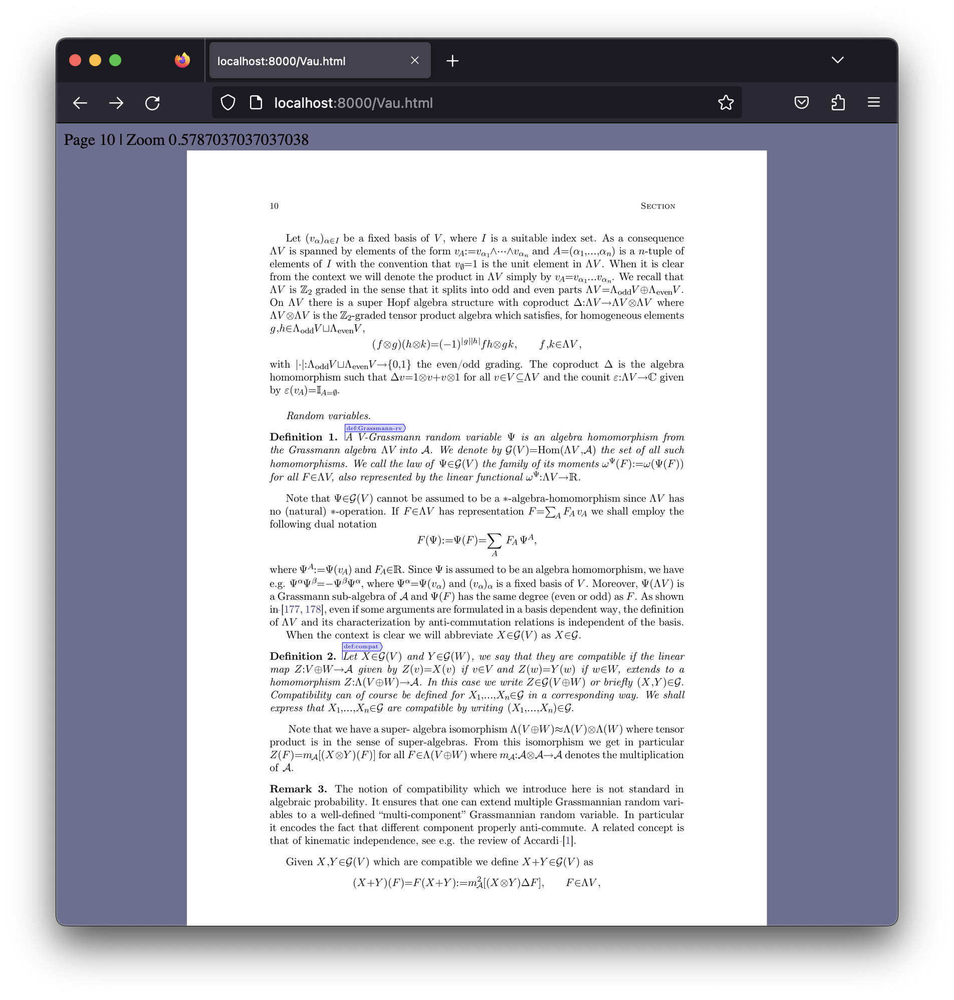

# Vau

**Vau** is an experiment/exercise over the TeXmacs codebase, to learn more about it. The initial goal is to extract enough machinery to be able to read and typeset arbitrary TeXmacs files. So **Vau** will be initially a viewer. This will allow me to understand the code dependencies and extract a minimal typesetting core, abstracted from the UI and the wider organization of the editor. In the meanwhile I plan to experiment about various refactorings.

### Glue code refactoring

I rewrote the Scheme glue code via C++ templating and metaprogramming and make it local to each submodule. Glue code should be defined locally where the relevant C++ function belongs, so that if a module is not linked in the corresponding glue code is not compiled in and will not be visible from scheme. 


## Logbook

Jan 2022 

- I have now a basic setup with an Xcode project and a CMake recipe. I switched to the S7 interpreter, added PDF Hummus and MuPDF support. Vau can read and export to PDF fairly complex documents with PDF Hummus and generate PNG images for pages with MuPDF. Typesetting is not optimized and all the document is retypeset from the beginning at every invocation of the output routines.

- I removed almost all the C++ code which is not used at this stage. And Vau load the minimal amount of Scheme code.

- Ideally we want to isolate away I/O, because e.g. in Webasm we do not have direct access to the filesystem and maybe this requires anyway async calls.

- From here I would like to understand how to isolate a well-defined interface for the editor which allow to call it from a scripting language (be it Scheme or Javascript). The editor receives commands and send back responses (e.g. bitmaps of the current page with metadata, like location of the cursors, etc..)


## Build instructons

Use CMake. We depend on [MuPDF](https://mupdf.com), which you can find on [github](https://github.com/ArtifexSoftware/mupdf), for example. 

For the native architecture of the machine
```
mkdir build; cd build;
cmake  ..
make
```
If CMake cannot find MuPDF, set the environment variable `MUPDF_DIR` to the root of the MuPDF installation.

CMake configures also the Xcode project which is found in `./platform/macos/Vau.xcodeproj`.

## Build and run Vau/Wasm

For the WebAssembly version, you will probably need to build it yourself MuPDF from sources, and in that case  we need to specify where to find the appropriate libraries. So build invocation for Vau is more complicated. Something like:
```
mkdir build; cd build;
emcmake cmake  .. -DMUPDF_LIBRARY=$MUPDF_BUILD_DIR/build/wasm/release/libmupdf.a -DMUPDF_THIRD_LIBRARY=$MUPDF_BUILD_DIR/build/wasm/release/libmupdf-third.a -DMUPDF_INCLUDE_DIR=$MUPDF_BUILD_DIR/usr/include
emmake make 
```
where again it is assumed that `MUPDF_BUILD_DIR` points to the folder where the MuPDF build has been performed. 

The build process produces three files : `Vau.html`, `Vau.data`, `Vau.js`. We need also `Vau.html` which is found in `./platform/wasm` and then we can serve it via `emrun`:
```
cp ../platform/wasm/Vau.html .
emrun --browser firefox Vau.html
```
The current script runs the main function of the Vau program,  retrieve the file `/vau-test.png` from the Emscripten memory filesystem and embed it in an image on the page. 

Screenshot:


