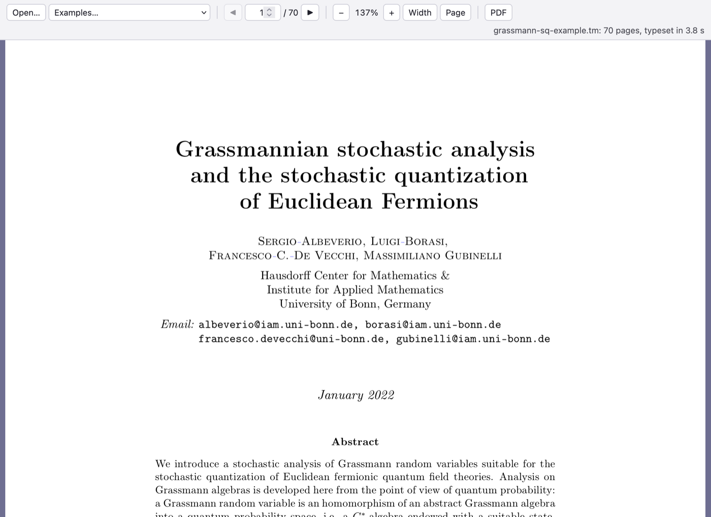

# Vau

**Vau** is an experiment/exercise over the TeXmacs codebase, to learn more about it. The initial goal is to extract enough machinery to be able to read and typeset arbitrary TeXmacs files. So **Vau** will be initially a viewer. This will allow me to understand the code dependencies and extract a minimal typesetting core, abstracted from the UI and the wider organization of the editor. In the meanwhile I plan to experiment about various refactorings.

### Glue code refactoring

I rewrote the Scheme glue code via C++ templating and metaprogramming and make it local to each submodule. Glue code should be defined locally where the relevant C++ function belongs, so that if a module is not linked in the corresponding glue code is not compiled in and will not be visible from scheme. 

## Logbook

Oct 2026

- Synced with TeXmacs: the sources and resources shared with TeXmacs now follow `maxs_texmacs` (TeXmacs 2.1.5, it contains `wip_fixes`), with the S7 port of `wip_s7` (S7 11.9, `boot-s7.scm`, `compat-s7.scm`) and the MuPDF plugin of `wip_other_guis` (which can also write the PDF, set `TEXMACS_PDF_MUPDF=1`). On top of these comes `maxs_texmacs`, with the support of OpenType math fonts (see `src/OPENTYPEMATH.md`) and the fonts themselves. The Scheme code is the one of TeXmacs, unmodified: `init-vau-s7.scm` loads the common `init-kernel.scm`, and the primitives of the TeXmacs glue which Vau lacks are defined as stubs (`vau-glue-stubs.scm`, generated by `devel/make-glue-stubs.py`). The WebAssembly port was reworked on this basis (see below): new build, a viewer with scrolling, zoom, files of the user and PDF export, and a test under node.

- For a test without window: `VAU_TEST_OUTPUT=/tmp/out ./Vau` writes `/tmp/out.png` (first page) and `/tmp/out.pdf`; `VAU_TEST_DOCUMENT` selects the document.

Feb 2022

- The library renders pixmaps in a worker thread and this is then put on a canvas which fills the viewport of the viewer. Implemented zoom and page change. We are still very slow in bootstrapping a document due to the loading of many fonts variations (mainly TeX fonts, which I should get rid of). After this slow typesetting phase, rendering speed is very good.

- Ideally we want to move the UI logic in Scheme and be able to both drive the typesetter and manage the UI at the browser level. I guess for the moment I will settle to drive the UI from the C++ code, maybe using `embind` and `val` to interface C++ with Javascript.

- Later on I will implement loading files from URL and possibily better caching to improve bootstrap. We already pre-cached some informations by loading it in the virtual file-system at startup, but this has not produced a substantial speedup.

Jan 2022 

- I have now a basic setup with an Xcode project and a CMake recipe. I switched to the S7 interpreter, added PDF Hummus and MuPDF support. Vau can read and export to PDF fairly complex documents with PDF Hummus and generate PNG images for pages with MuPDF. Typesetting is not optimized and all the document is retypeset from the beginning at every invocation of the output routines.

- I removed almost all the C++ code which is not used at this stage. And Vau load the minimal amount of Scheme code.

- Ideally we want to isolate away I/O, because e.g. in Webasm we do not have direct access to the filesystem and maybe this requires anyway async calls.

- From here I would like to understand how to isolate a well-defined interface for the editor which allow to call it from a scripting language (be it Scheme or Javascript). The editor receives commands and send back responses (e.g. bitmaps of the current page with metadata, like location of the cursors, etc..)

## Build instructons

Use CMake. We depend on [MuPDF](https://mupdf.com), which you can find on [github](https://github.com/ArtifexSoftware/mupdf), for example.  The MuPDF plugin needs a recent version (it is developed against 1.26–1.28, e.g. the one of Homebrew: `MUPDF_DIR=/opt/homebrew`). The native viewer also needs SDL2.

For the native architecture of the machine
```
mkdir build; cd build;
cmake  ..
make
```
If CMake cannot find MuPDF, set the environment variable `MUPDF_DIR` to the root of the MuPDF installation.

CMake configures also the Xcode project which is found in `./platform/macos/Vau.xcodeproj`.

## Build and run Vau/Wasm

The WebAssembly version needs Emscripten and a build of MuPDF (1.26 or later) for WebAssembly, with the same model of exceptions as Vau (`-fwasm-exceptions`). Two scripts of `devel/`, adapted from those of TeXmacs, set this up:
```
. devel/emenv.sh build-wasm            # Emscripten, with a Python >= 3.10
sh devel/build-mupdf-wasm.sh build-wasm  # fetches and builds MuPDF 1.28.5 in build-wasm
cd build-wasm
emcmake cmake .. -DCMAKE_BUILD_TYPE=Release -DMUPDF_SOURCE_DIR=$PWD/mupdf-1.28.5-source
emmake make -j8
```
`MUPDF_SOURCE_DIR` may point to sources of MuPDF built elsewhere in the same way (`build/wasm/slim`, or another directory given with `-DMUPDF_WASM_BUILD=`). Freetype and zlib are those which MuPDF carries. PDF Hummus is not part of this build: the PDF is written by the MuPDF plugin.

The build gives `Vau-wasm.js`, `Vau-wasm.wasm` and `Vau-wasm.data` (the resources, without the icons of the interface and the tests), and copies the page next to them. To try it:
```
node test-node.mjs    # without a browser: typesets a document, writes vau-test.png and vau-test.pdf
node serve.mjs 8080   # then open http://localhost:8080/
```

The files of `platform/wasm`:

- `Vau.html`, the viewer: it opens the documents which come with Vau, or a `.tm` file of yours (button or drop), shows a page at a time (wheel, arrows, Page Up/Down, Home/End), zooms (`+`, `-`, `W` for the width, `0` for the whole page, Ctrl+wheel) and exports the PDF. `Vau.html?doc=/Vau/...` opens a document of the library, `Vau.html?log` sends its output to the console.
- `vau_worker.js`, the worker in which the library runs: the page sends `[method, id, args]` and gets the result back, the pixmaps as transferred buffers. Its methods (`openDocument`, `openBuffer`, `pageCount`, `pageSize`, `getPagePixmap`, `getViewPixmap`, `exportPdf`, `evalScheme`) are functions of the object `vau` of the page which return promises.
- `mylib.js`, what the library calls in JavaScript.
- `serve.mjs` and `test-node.mjs`, the server and the test above.

The library exports the functions `wasm_*` of `src/Vau/vau_lib.cpp`.

Screenshot:


